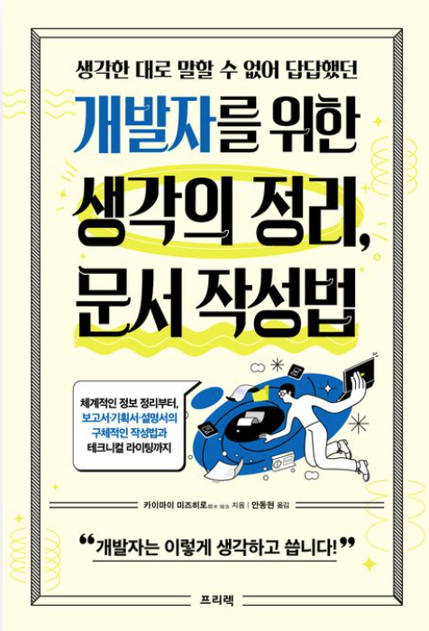

# 생각한 대로 말할 수 없어 답답했던 개발자를 위한 생각의 정리, 문서 작성법

## 책 정보

| 항목       | 내용                                                                                 |
| ---------- | ------------------------------------------------------------------------------------ |
| **제목**   | 생각한 대로 말할 수 없어 답답했던 개발자를 위한 생각의 정리, 문서 작성법             |
| **소제목** | 체계적인 정보 정리부터, 보고서·기획서·설명서의 구체적인 작성법과 테크니컬 라이팅까지 |
| **저자**   | 카이마이 미즈히로 (글) · 안동현 (번역)                                               |
| **표지**   |                                                              |
| **링크**   | [📎 교보문고](https://product.kyobobook.co.kr/detail/S000213221976)                  |

---

## 선정 이유

코드를 통해 개념을 설명하는 것은 가능하지만, **코드 없이 말과 문서로 표현하는 것은 어렵다**.  
이러한 고민을 해결하기 위해 이 책을 선택했다.

- **복잡한 개념을 쉽게 설명하는 기술**
- **논리적으로 사고하고 체계적으로 정리하는 방법**
- **자신의 생각을 효과적으로 전달하는 문서 작성법**

책에서는 생각 정리를 위한 논리도(logical diagram)를 추천한다.  
이를 통해 복잡한 개념을 논리적으로 정리하고, 보다 명확하게 설명할 수 있는 방법을 익히고자 한다.

---

## 목차

### **개념 정리**

1. **이 보고서는 어째서 이렇게 이해하기 쉬운 걸까?**  
   → [📖 1장: 정돈되지 않은 정보는 이해하기 어렵다](#1장-정돈되지-않은-정보는-이해하기-어렵다)

2. **설명문이 너무 길다! 어떻게 정리해야 할까?**  
   → [📖 2장: 긴 글 정리는 범주와 요점에서 시작한다](#2장-긴-글-정리는-범주와-요점에서-시작한다)

3. **이 구조를 보면 개조식 목록이나 트리 구조로는 이해 못 할 것 같은데?**  
   → [📖 3장: 복잡하게 얽힌 주제라면 GPS를 떠올리자](#3장-복잡하게-얽힌-주제라면-gps를-떠올리자)

4. **로직트리든 MECE든 정말 의미가 있을까?**  
   → [📖 4장: 논리적 사고의 기본을 이해하자](#4장-논리적-사고의-기본을-이해하자)

5. **"그래서 결론이 뭐야?"라는 소리를 자주 듣는다...**  
   → [📖 5장: 보고서](#5장-보고서)

6. **기획서의 첫 번째 골자는 5W1H가 아니다?**  
   → [📖 6장: 기획서 & 제안서](#6장-기획서--제안서)

7. **목적과 목표의 차이, 문제와 장애의 차이는?**  
   → [📖 7장: 문제 해결에 도움이 되는 정보 정리 노하우](#7장-문제-해결에-도움이-되는-정보-정리-노하우)

8. **내가 만든 차트가 쓸데없는 장식이 많다고 한다...**  
   → [📖 8장: 더 좋은 도해를 그리기 위한 시각 디자인 기초 지식](#8장-더-좋은-도해를-그리기-위한-시각-디자인-기초-지식)

9. **문단 처음에 들여쓰기? 동어 반복을 피해야 할까?**  
   → [📖 9장: 글쓰기 주의사항](#9장-글쓰기-주의사항)

---

## 1장: 정돈되지 않은 정보는 이해하기 어렵다

<br/>

### 논리도해 (Logical Diagram)

> **논리도해**란?  
> 단어나 개념을 사각형/원으로 정리하고, 선이나 화살표로 연결하여 **논리 구조를 표현하는 방법**이다.
> <br/>

### 정보 정리는 곧 사고 정리

- **떠오르는 대로 적은 글은 난잡하다** → 반복 등장하는 요소들을 그룹화하고 정리해야 한다.
- **분류되지 않은 긴 글은 글이 아니다** → 섹션과 제목을 추가해야 읽기 쉬운 구조가 된다.
- **범주(category)와 요점(summary)를 정리하자** → 정보를 구조화하면 이해하기 쉬워진다.
  <br/>

### GPS 원칙: 정보 정리의 3가지 흐름

1. **Group (그룹화 / 병렬, Parallel)** → 유사한 개념을 묶는다.
2. **Parallel (병렬)** → 개념 간 관계를 정리한다.
3. **Series (순서화, Series)** → 순서가 중요한 항목을 정리한다.

```
ex) 빛의 삼원색을 GPS 원칙으로 정리

🛠 GPS 원칙 적용
Group (그룹화 / 병렬, Parallel) → 빛의 삼원색 (RGB) 그룹화
Parallel (병렬) → 각 색상이 서로 독립적이며 조합 가능
Series (순서화, Series) → 색을 혼합하여 새로운 색을 생성하는 과정
```

<br/>

**정리하는 방법**

- 먼저 그룹이 될 부분을 찾는다.
- 여러 개의 그룹을 표 형식으로 만들 수 있는지 생각한다.
- 그룹 내 요소의 순서를 결정할 기준을 찾는다.

</br>

---

## 2장: 긴 글 정리는 범주와 요점에서 시작한다

### 요약하는 습관을 들이자

보고서를 작성할 때 **아무리 길더라도 3줄 정도로 요약하는 습관**을 들이자.  
이때 도움이 되는 것이 **범주와 요점 사고방식**이다.

- **좋은 보고서**: 시작 부분에 요약이 포함되어 있어 **핵심을 빠르게 파악할 수 있음**.
- **나쁜 보고서**: 끝까지 읽어야만 내용을 이해할 수 있으며, 요점을 알 수 없음.

📌 **효과적인 보고서를 위해, 시작 부분에 요약을 포함하자.**

예제 📄

```plaintext
문제점: 명확하지 않은 절차 메뉴얼, 오류 발생, 입력 오류
나쁜 영향: 공수 50% 증가
해결 방법: 절차 메뉴얼 품질 향상, 오류 검출 및 자동 수정 기능 추가 예정

// 본문 시작
S 프로젝트에.... (이하 생략)
```

위 예제에서 **문제점, 나쁜 영향, 해결 방법**이 **범주**이며, 그에 대한 내용이 **요점**이다.

**요점이란?**

- **구체성이 높은 정보**를 의미한다.
- 즉, **요점의 역할은 몰랐던 정보를 확정하는 것**이다.

**📌 글쓰기 방법보다 "주제가 무엇인가?"를 분명하게 하자!**

</br>

---

## 3장: 복잡하게 얽힌 주제라면 GPS를 떠올리자

2장에서 다룬 **범주 사고방식**은 정보 정리에 도움이 되지만, **구조를 표현하는 데는 한계**가 있다.  
요소들 사이의 관계를 **시각적으로 나타내기 어려운 문제**가 있다. 이를 해결하려면 **구성도(도해)를 활용**하면 된다.

### GPS 원칙 적용

| **카테고리**  | **G (그룹화, Group)** | **P (병렬, Parallel)** | **S (순서화, Series)** |
| ------------- | --------------------- | ---------------------- | ---------------------- |
| **정보 정리** | 범주 & 요점 파악      | 관계를 시각적으로 정리 | 순서에 따라 구조화     |
| **GPS 활용**  | 주요 개념을 그룹화    | 요소들 간 관계 정의    | 흐름과 순서를 정리     |

### GPS를 활용한 정보 정리

- **복잡한 정보 속에서 GPS를 찾아라.**
- **잘게 나눈 정보는 독자가 다양한 관점에서 생각할 수 있도록 돕는다.**
- **그룹을 정하지 않으면, 목적도 불명확해진다.**

**범주와 요점은 도해 안에서 "무엇을" 쓸지 결정하는 것이고, GPS는 "어떻게" 쓸지를 결정하는 것이다.**

---

## 4장: 논리적 사고의 기본을 이해하자

</br>

논리적 사고는 **정답을 찾는 것이 아니라, 쓸모없는 선택지를 효율적으로 제거하는 과정**이다.  
이를 위해 **로직트리(Logic Tree)**와 **MECE(Mutually Exclusive and Collectively Exhaustive)** 개념을 사용한다.

### 논리적 사고 과정

```plaintext
1. 질문을 확정한다 → 내일은 비가 올까?
2. 일반 법칙을 정한다 → 대기는 서쪽에서 동쪽으로 이동한다는 법칙 적용
3. 확인할 독립 사건을 정한다 → 서쪽에 비가 내리는지가 중요
4. 관찰 대상을 정한다 → 서쪽 지역 대기 상태 조사
5. 관찰 사실을 확인한다 → 현재 서쪽에는 비구름이 없음
6. 결론을 내린다 → 내일은 비가 내리지 않을 가능성이 높음
```

**즉, 논리적으로 사고한다는 것은 "배경 정보, 질문, 법칙, 관찰 대상, 사실, 결론, 행동"을 명확히 하는 것!**
<br/>

### 로직트리 & MECE 활용하기

- **로직트리**: 결론과 이유를 나무 구조로 정리
- **MECE 원칙**: 중복 없이 & 빠짐 없이 정리

**예시: "웹사이트 속도가 느린 이유 분석"**


**분석 과정**

1. 문제를 설정 → "웹사이트 속도가 느린 이유는?"
2. 1단계 대분류 → "서버 부하" or "통신 회선 부하"
3. 2단계에서 각각의 요소를 구체화
4. 이를 통해 **CDN 도입을 검토**하는 결론 도출

**MECE 원칙을 적용하기 어려울 경우, 문제를 깊이 이해할 기회로 삼고 문제 설정을 다시 고려하자!**  
이때 **문제의 이유와 기준을 명확히 정하는 것이 핵심**이다.

---

## 5장: 보고서

</br>

정보를 **하나로 정리하여 효과적으로 보고할 수 있어야 한다.**  
이를 위해 다양한 패턴이 존재하며, 각각의 패턴은 특정한 상황에서 유용하다.

### [상태 → 트리거 → 사고 → 손해 패턴]

**복잡한 인과관계를 표현하는 데 적합한 패턴**

| **요소**   | **설명**                | **예시**                    |
| ---------- | ----------------------- | --------------------------- |
| **상태**   | 현재의 상황             | "서버 응답 속도가 느림"     |
| **트리거** | 문제를 발생시킨 원인    | "DB 부하 증가로 인해"       |
| **사고**   | 발생한 문제             | "일부 요청이 타임아웃 발생" |
| **손해**   | 문제로 인해 발생한 결과 | "사용자 불만 증가 및 이탈"  |

**이 패턴을 활용하면 원인과 결과를 논리적으로 정리할 수 있음.**

### [구조 → 사건 → 대처 패턴]

**발생한 문제를 설명하는 데 적합한 패턴**

| **요소** | **설명**                             | **예시**                        |
| -------- | ------------------------------------ | ------------------------------- |
| **구조** | 원래의 시스템 상태                   | "로그인 시스템 운영 중"         |
| **사건** | 사람이 개입하지 않아도 발생하는 문제 | "서버 장애로 인해 로그인 불가"  |
| **대처** | 문제를 해결하기 위한 조치            | "서버 재시작 및 장애 원인 분석" |

**문제가 발생했을 때, 보고서를 통해 효과적인 대응을 기록할 수 있음.**

### [IAEJ 패턴](구조 → 행동 → 사건 → 판단)

**문제 해결 과정에서 논리적인 의사결정을 표현하는 패턴**

| **요소**     | **설명**                  | **예시**                        |
| ------------ | ------------------------- | ------------------------------- |
| **I (구조)** | 현재 상태                 | "결제 프로세스 정상 작동 중"    |
| **A (행동)** | 사용자의 행동             | "사용자가 주문을 결제함"        |
| **E (사건)** | 예상치 못한 문제 발생     | "결제 요청이 실패함"            |
| **J (판단)** | 문제를 해결하기 위한 결론 | "결제 시스템 점검 및 복구 진행" |

**IAEJ 패턴을 사용하면 보고서에서 문제의 흐름을 체계적으로 정리할 수 있음.**

## 🔍 결론

보고서는 단순히 정보를 나열하는 것이 아니라, **논리적인 패턴을 적용하여 정리해야 한다.**

- 복잡한 인과관계 정리는 **"상태 → 트리거 → 사고 → 손해" 패턴** 사용
- 사건 중심의 문제 보고는 **"구조 → 사건 → 대처" 패턴** 활용
- 문제 해결 과정 보고는 **"IAEJ 패턴"** 활용

**이러한 패턴을 활용하면 논리적이고 명확한 보고서를 작성할 수 있다!**

---

</br>

## 6장: 기획서 & 제안서

### [목표 → 현상 → 정책 → 성과 패턴]

**기획서의 핵심 구조로, 전체적인 흐름을 잡는 데 유용한 패턴**

| **단계**                  | **설명**                      | **예시 (웹 개발 기획서)**                          |
| ------------------------- | ----------------------------- | -------------------------------------------------- |
| **현상 분석**             | 현재 상황과 문제 파악         | "웹사이트 로딩 속도가 평균 5초 이상 걸린다."       |
| **기획 목적 & 전체 모습** | 목표, 정책, 기대 성과 정의    | "로딩 속도를 2초 이내로 단축하여 사용자 경험 향상" |
| **구체적인 기획 내용**    | 누가, 무엇을, 어떻게 해결할지 | "코드 스플리팅 및 이미지 최적화를 적용"            |
| **스케줄**                | 작업 일정 계획                | "1개월 내 A/B 테스트 후 적용"                      |
| **수지 계획**             | 예산 및 비용 분석             | "CDN 사용 비용 증가 예상, ROI 분석 포함"           |

**이 패턴을 사용하면 프로젝트 기획을 체계적으로 정리할 수 있음.**

### [6W2H 사고법]

**기획의 방향성을 명확하게 잡는 데 유용한 질문 기반 패턴**

| **항목**     | **설명**               | **예시 (FE 프로젝트 기획)**             |
| ------------ | ---------------------- | --------------------------------------- |
| 🧑 **Who**   | 기획 대상              | "웹사이트 방문자"                       |
| **Whom**     | 대상 고객              | "모바일 사용자"                         |
| **What**     | 무엇을 만들 것인가     | "PWA(Progressive Web App)"              |
| **When**     | 언제 개발할 것인가     | "3개월 내 MVP 출시"                     |
| **Where**    | 어디에서 운영할 것인가 | "AWS 클라우드 환경"                     |
| **Why**      | 왜 필요한가            | "네이티브 앱 없이도 오프라인 기능 제공" |
| **How**      | 어떻게 만들 것인가     | "Service Worker 및 IndexedDB 활용"      |
| **How much** | 비용은 얼마나 드는가   | "서버 비용 월 30만 원 예상"             |

**이 질문들을 활용하면 기획이 논리적이고 체계적으로 정리됨.**

### [PREP 패턴]

**의견을 논리적으로 전달하는 데 유용한 패턴**

| **요소**     | **설명**            | **예시 (React를 도입해야 하는 이유)**                    |
| ------------ | ------------------- | -------------------------------------------------------- |
| **Point**    | 가장 말하고 싶은 것 | "React를 사용하면 유지보수가 쉬워진다."                  |
| **Reason**   | 그 이유             | "컴포넌트 기반 개발로 코드 재사용성이 증가한다."         |
| **Evidence** | 근거 자료           | "Facebook 및 대기업에서 React를 도입하여 생산성 향상"    |
| **Example**  | 구체적인 사례       | "다른 팀도 React로 전환 후, 코드 중복이 30% 감소"        |
| **마무리**   | 결론 반복           | "따라서, React를 도입하면 유지보수와 생산성이 향상된다." |

**PREP 패턴을 활용하면 논리적으로 설득력 있는 기획서를 작성할 수 있음.**

**변형: AREA 패턴**

- `Point` 대신 `Assertion(주장)`을 사용하여 **강한 의견 전달** 가능
- 활용 예: "Next.js는 SEO 최적화에 필수적이다."

### [FABE 패턴]

**경쟁 상대가 있을 때, 비교 우위를 강조하는 패턴**

| **요소**               | **설명**               | **예시 (Vue vs React 비교 기획서)**                     |
| ---------------------- | ---------------------- | ------------------------------------------------------- |
| **Feature (특징)**     | 대상의 핵심 기능       | "Vue는 선언적 템플릿을 제공한다."                       |
| **Advantage (우위성)** | 경쟁 제품보다 나은 점  | "초심자가 빠르게 학습할 수 있다."                       |
| **Benefit (이익)**     | 사용자의 실질적인 이점 | "팀 내 신규 개발자의 생산성이 증가"                     |
| **Evidence (증거)**    | 근거 자료              | "기업 내부 테스트에서 Vue 도입 후 온보딩 속도 20% 향상" |

**FABE 패턴은 제품/기술 비교 보고서에서 유용하게 활용됨.**

### 긴 글 작성 팁: 패러그래프 라이팅

- **한 문단(Paragraph) = 하나의 주제**
- **첫 문장은 핵심 메시지, 이후 설명**
- **같은 내용을 여러 문장에서 반복하지 않기**
- **논리적 연결어를 활용하여 흐름을 자연스럽게 만들기**

**FE 기획서 작성 예시**

```plaintext
 기존 웹사이트는 SSR을 사용하지 않아 SEO가 취약하다.
 해결책으로 Next.js를 도입하면 검색 엔진 최적화가 가능하다.
 React 기반 프로젝트와의 호환성도 뛰어나 기존 코드 재사용이 가능하다.
```

**이처럼 문단을 나누면 가독성이 좋아지고 논리적으로 정리됨.**

## 🔍 결론

- 프로젝트 기획서는 **목표 → 현상 → 정책 → 성과** 패턴을 따르는 것이 효과적.
- 논리적인 사고를 돕는 **6W2H 질문법**을 활용하면 체계적으로 기획 가능.
- **PREP 패턴**을 활용하면 설득력 있는 제안서를 작성할 수 있음.
- **FABE 패턴**은 경쟁사 대비 우위를 강조하는 기획서에서 강력한 무기.
- 긴 글을 쓸 때는 **패러그래프 라이팅** 기법을 적용하여 가독성을 높이자.

**이러한 패턴을 활용하면 논리적이고 효과적인 기획서를 작성할 수 있다!**

---

## 7장: 문제 해결에 도움이 되는 정보 정리 노하우

### 문제 해결을 위한 5단계 접근법

| **단계**           | **설명**                     | **예시 (프론트엔드 오류 해결)**       |
| ------------------ | ---------------------------- | ------------------------------------- |
| **문제 분석**      | 해결해야 할 핵심 문제를 정의 | "React에서 버튼 클릭이 작동하지 않음" |
| **원인 분석**      | 문제를 일으키는 원인 파악    | "이벤트 리스너가 바인딩되지 않음"     |
| **해결 방안 입안** | 해결책을 구상                | "useEffect를 사용하여 리스너 추가"    |
| **구체화**         | 구체적인 해결 방안 작성      | "onClick 핸들러를 명확하게 바인딩"    |
| **실행**           | 해결책 적용 및 테스트        | "버튼 클릭이 정상적으로 작동함"       |

### 정적 구조 vs 동적 구조

- **정적 구조**: 시스템이 기본적으로 갖추고 있는 구조 (코드 구조, 데이터베이스 설계 등)
- **동적 구조**: 실행 중 발생하는 개별적인 상태 (오류 메시지, 특정 요청 데이터 등)

**문제 해결 시 정적 구조와 동적 구조를 균형 있게 분석해야 함!**  
예시: 프론트엔드 오류 발생 시 콘솔 오류 로그(동적 구조)뿐만 아니라 컴포넌트 상태 관리 방식(정적 구조)도 고려해야 함.

---

## 8장: 더 좋은 도해를 그리기 위한 시각 디자인 기초 지식

### 도해의 원칙: **"도해는 그림이 아니다"**

도해를 만들 때 **정보 전달에 초점을 맞춰야 하며, 불필요한 장식을 피해야 한다.**

| **피해야 할 요소**        | **바람직한 방식**               |
| ------------------------- | ------------------------------- |
| 사람 얼굴, 장식 과다      | 핵심 정보만 시각적으로 표현     |
| 과도한 아이콘 사용        | 필수적인 아이콘만 활용          |
| 여백이 너무 많거나 부족함 | 균형 잡힌 레이아웃 사용         |
| 강조색을 남발             | 기본색과 강조색을 조화롭게 사용 |

**예시: 데이터 시각화에서 차트 작성 시**

- 막대 그래프에 불필요한 3D 효과, 그림자 사용
- 데이터 비교를 명확하게 표현하는 간결한 2D 그래프 사용

---

## 9장: 글쓰기 주의사항

### 블록 스타일 vs 종이 패턴 스타일

- **종이 패턴 스타일**: 첫 줄 들여쓰기, 문단 구분이 없음 → **전통적인 방식**
- **블록 스타일**: 문단 사이에 빈 줄 추가 → **가독성이 좋은 최신 방식**

**최근에는 블록 스타일(문단 사이 빈 줄 포함)이 웹 환경에 더 적합함.**

**예시: 블록 스타일 글쓰기**

```plaintext
//good
블록 스타일
React에서 이벤트 핸들러를 사용할 때는 useCallback을 활용하는 것이 좋다.

useCallback을 사용하면 함수가 매 렌더링마다 재생성되지 않아 성능 최적화에 유리하다.
```

```plaintext
//bad
종이 패턴 스타일
React에서 이벤트 핸들러를 사용할 때는 useCallback을 활용하는 것이 좋다. useCallback을 사용하면 함수가 매 렌더링마다 재생성되지 않아 성능 최적화에 유리하다.
```

**웹 문서는 블록 스타일이 가독성 면에서 우수하기 때문에 추천됨!**

## 결론

- **문제 해결을 위한 5단계 접근법을 적용하면 논리적인 사고가 가능함.**
- **정적 구조와 동적 구조를 균형 있게 분석해야 효과적인 문제 해결이 가능함.**
- **도해 작성 시 장식보다 정보 전달이 우선이며, 기본색과 강조색의 균형이 중요함.**
- **웹 환경에서는 블록 스타일(문단 사이 빈 줄 추가)이 가독성 면에서 더 적합함.**

**이러한 원칙을 적용하면 논리적이고 효율적인 글쓰기와 도해 작성이 가능하다!**

---

## 후기

이 책을 읽으며 단순한 문서 작성법뿐만 아니라, 생각을 정리하는 방법 자체를 깊이 배울 수 있었다.

평소 아키텍처 설계, 사내 라이브러리 개발 후 공유, 문서화, 발표 등 다양한 작업을 수행해 왔다. 단순히 코드를 작성하는 것을 넘어, 이를 명확하게 정리하고, 효과적으로 전달하는 과정이 중요하다는 것을 실감했지만, 이를 더 체계적으로 다듬고 싶다는 고민이 있었다.

이 책을 통해 정보를 구조화하고 논리적으로 전달하는 방법을 배울 수 있었고, 이를 바탕으로 앞으로 문서를 더욱 체계적으로 정리하고, 발표나 공유 과정에서도 더 명확하고 설득력 있는 커뮤니케이션을 할 수 있을 것 같다.
