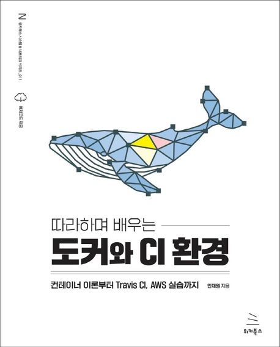

# 🐳 따라하며 배우는 도커와 CI 환경

## 책 정보

| 항목       | 내용                                                                |
| ---------- | ------------------------------------------------------------------- |
| **제목**   | 따라하며 배우는 도커와 CI 환경                                      |
| **소제목** | 컨테이너 이론부터 Travis CI, AWS 실습까지                           |
| **저자**   | 안재원                                                              |
| **표지**   |                                             |
| **링크**   | [📎 교보문고](https://product.kyobobook.co.kr/detail/S000001766491) |

---

## 선정 이유

도커는 "한 번 만들면, 어디서든 실행된다"는 컨셉으로  
개발 환경의 차이로 발생하는 에러를 최소화하고, **배포와 운영을 통합**하는 핵심 기술로 자리잡았습니다.

- 환경 구성의 반복을 제거
- 동일한 환경에서 테스트 및 배포 가능
- 컨테이너 기반 마이크로서비스 아키텍처 구현에 필수

## 목차

1. [도커란?](#1-도커란)
2. [직접 도커 이미지 생성하기](#2-직접-도커-이미지-생성하기)
3. [도커를 이용한 Node.js 애플리케이션 만들기](#3-도커를-이용한-nodejs-애플리케이션-만들기)
4. [다중 컨테이너 애플리케이션 설계](#4다중-컨테이너를-활용한-애플리케이션의-개발-환경-구축)
5. [후기 및 개선점](#후기)

## 1. 도커란?

### 설치 방식 비교

| 방식      | 특징                               | 단점                             |
| --------- | ---------------------------------- | -------------------------------- |
| 기존 설치 | 인스톨러 실행 → 수동 설치          | OS나 라이브러리 차이로 오류 발생 |
| 도커 사용 | 컨테이너로 빠르고 동일한 환경 구성 | 도커 학습 필요                   |

### 도커와 컨테이너

> **AWS 정의**  
> 도커는 애플리케이션을 신속하게 구축, 테스트, 배포할 수 있는 **소프트웨어 플랫폼**이다.  
> 소프트웨어를 **컨테이너**라는 단위로 패키징하며, 해당 컨테이너는 실행에 필요한 모든 요소를 포함한다.

- 라이브러리, 시스템 도구, 코드, 런타임 포함
- 환경에 구애받지 않고 배포 가능

### 이미지 vs 컨테이너

| 용어              | 설명                                                                            |
| ----------------- | ------------------------------------------------------------------------------- |
| **도커 이미지**   | 응용 프로그램 실행에 필요한 코드, 설정, 라이브러리, 시스템 도구가 포함된 패키지 |
| **도커 컨테이너** | 이미지를 실행한 **인스턴스**, 격리된 환경에서 동작함                            |

→ **이미지는 설계도**, **컨테이너는 실행 중인 프로그램**이라고 생각하면 이해 쉬움.

### 도커의 작동 흐름

도커 클라이언트 → 도커 데몬 → 컨테이너

### 기존 가상화 기술과의 차이

| 항목 | 하이퍼바이저 기반 VM | 도커                              |
| ---- | -------------------- | --------------------------------- |
| 구조 | OS 위에 VM 설치      | OS 위에 컨테이너 실행             |
| 커널 | 각각 독립            | **공유 커널**                     |
| 성능 | 오버헤드 존재        | 가볍고 빠름                       |
| 장점 | 완벽한 분리          | 빠른 배포, 경량화                 |
| 단점 | 느리고 무거움        | 커널 공유로 보안에 민감할 수 있음 |

### 핵심 기술: Cgroup & 네임스페이스

| 기술             | 설명                                        |
| ---------------- | ------------------------------------------- |
| **Cgroup**       | CPU, 메모리 등 시스템 자원 제한 및 모니터링 |
| **네임스페이스** | 프로세스 격리 기술, 독립된 환경 제공        |

## 2. 직접 도커 이미지 생성하기

### 🏗️ 도커 이미지 생성 순서

1. `Dockerfile` 작성
2. 도커 빌드 명령으로 이미지 생성
3. 생성된 이미지로 컨테이너 실행

### Dockerfile 예시

```dockerfile
FROM node:18
WORKDIR /app
COPY package.json .
RUN npm install
COPY . .
CMD ["node", "server.js"]
```

## 3. 도커를 이용한 Node.js 애플리케이션 만들기

### 프로젝트 구조

```plaintext
my-app/
├── Dockerfile
├── package.json
└── server.js
```

## 3.1 도커 볼륨

### 개념

| 방식       | 설명                                           |
| ---------- | ---------------------------------------------- |
| `COPY`     | 이미지 빌드 시 파일을 복사함                   |
| **Volume** | **호스트 디렉토리와 실시간으로 연결**됨 (참조) |

예시:

\`\`\`bash
docker run -v $(pwd):/app -p 3000:3000 node-app
\`\`\`

## 4.다중 컨테이너를 활용한 애플리케이션의 개발 환경 구축

**멀티 컨테이너 구조**

| 구성 요소   | 설명                           |
| ----------- | ------------------------------ |
| Nginx       | 요청 분기, 정적 파일 제공      |
| 프론트 서버 | React/Vue 등 SPA               |
| 백엔드 서버 | API 서버 (Node.js, Express 등) |

- 설계 방식 1: 프록시 + 정적 파일 제공
  -> 단점: Nginx가 많은 역할을 담당하게 됨 (복잡도 증가)
- 설계 방식 2: 정적 파일만 제공
  -> 장점: 단순하고 명확  
  -> 단점: 포트 변경 시 설정 수정 필요

## 후기

도커의 기본 개념부터 실무 활용까지 한 번에 정리할 수 있었다.  
볼륨과 CI/CD의 예시는 보완이 필요하니 공식 문서를 추가로 참고하면 좋겠다.
